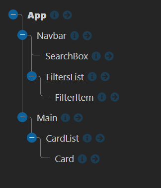
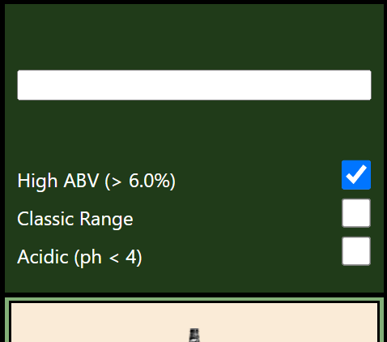

# Feedback

Hey Charlie here, feel free to message me on Slack if you want any clarification on the points below. I will give you both positive and constructive feedback on your project.

---

## Requirements

- Should be built in React - DONE
- Use the Punk API (after using the data file first) - DONE
- Test where possible (RTL) - NOT DONE
  - Only recently covered, give it a go when you get a chance
- Repository on GitHub - DONE
  - BONUS POINTS FOR GETTING IT HOSTED!! :)

### Start

> "All the wireframe content in black is the first part of the challenge - that is, the sidenav, the main section containing the beers and beer cards for each piece of data. The component tree is below to help you get started."



Your component tree looks great, you have matched the diagram in the brief. It may seem like overkill but it forces you to use props to get the data to the components that need it.

When you are building things in React have a go at breaking your project into a component tree before you go in with the code. It will help you manage all of the moving pieces.

### Extension 1

> Once you've got the design and layout sorted to render the elements, it's time to add some search functionality. Make it so you can search the beers by their name, and the page content should update as you type each letter in the box.

The aim of this extension is to get you using functions as props. You have smashed it, `handleInput()` in your app is being passed multiple component levels to your search component. That component is using the function to capture the user input and storing it in the App state. You are then able to use the value to filter the beers you get back from the API.

This is great!

There is an alternative way of doing this, this is with query params. On the docs it has `beer_name` which you can append to the url with a name you want to search. As you are doing the some of the filtering with query params as an extension why not try and implement search with this?

```jsx
// App.jsx
// getBeers
if (searchTerm) finalUrl + "?beer_name=" + "WHAT WOULD THE VALUE BE?";
```

### Extension 2

> Finally attempt to make it so you can filter the content on three conditions:
>
> - High Alcohol (ABV value greater than 6%)
> - Classic Range (Was first brewed before 2010)
> - High Acidity (pH lower than 4)

Nice going with this I can see you are updating your api URL with the correct params to get by abv and by classic range.

To do so you are using functions as props, your `handleChange()` takes the event which you use to toggle state, so you know which filter you need to apply.

You can refactor this function.

```jsx
// App.jsx
const handleChange = event => {
  const checked = event.target.checked; // THIS IS A BOOLEAN -> TRUE / FALSE
  const value = event.target.value; // I AM USING CONST AS YOU DO NOT NEED TO CHANGE EITHER VARIABLES
  if (value === "High ABV (> 6.0%)") setHighABV(checked); // SET THE STATE TO THIS VALUE
  if (value === "Classic Range") setClassicRange(checked);
  if (value === "Acidic (ph < 4)") setPh(checked);
};
```

With the ph you have spotted that you can not filter with the api. I can see you filter your results based the toggle. Just a small point you are doing multiple filters which means you are looping through your data twice.

You filters job is to remove any beers that don't match so I would argue to save doing two loops you are fine to move the logic into one loop.

```jsx
// App.jsx

// ORIGINAL
const filteredBeers = beers
  .filter(beer => {
    const beerNameLower = beer.name.toLowerCase();
    return beerNameLower.includes(searchTerm);
  })
  .filter(beer => {
    if (ph) return beer.ph && beer.ph < 4;
    else return beer;
  });

// COULD BE
const filteredBeers = beers.filter(beer => {
  const beerNameLower = beer.name.toLowerCase();

  if (ph) return beer.ph && beer.ph < 4 && beerNameLower.includes(searchTerm);

  return beerNameLower.includes(searchTerm);
});
```

### Extension 3

> Style the website however you see fit! Go wild!

Completed :)

## The App

### Positive

- It looks good on desktop.
- I can see you have started adding media queries as well which is great!
- You have managed to fit 80 beers into it!
  - They stack at different screen sizes

### Constructive

I think you will want to add a couple of small touches to finish it off.

- Update the readme.md so it is not the auto generated file.
  - What was the brief? What is the link to the live site?
  - [Markdown in 10mins](https://www.markdowntutorial.com/)

- Give the project a name and add a heading to the app. 

- Some of the cards text is quite large, do you think you could only display the first sentence?

  - The description will be a string, what methods can you use on a string?

- The nav sitting on top is a nice touch, It does have quite a lot of space around it though on mobile.



---

## The Code

### Positive

Very well componentized code across the board. I like that you have divided your components into components / containers.

You have multiple functions being passed across your application.

You are utilizing the power of query params!

I feel confident with your understanding of props, useState, useEffect and funcs as props.

I like that you are handling the scenario that a beer might not exist, this is Brilliant :).

Awesome good going! I can't wait to see what you build next.

### Constructive

- In public/index.html update `<title>React App</title>`

You are not using BEM and not using nesting with scss. This is something you need to be aware of that as a React application grows and you create more components you do not want styles from one component being applied to others.

Using BEM and nesting your styles can stop this from happening. Below are some examples of using both on your `<Card/>` component.

```
// Card.jsx
const Card = ({ picture, name, description }) => {
  return (
    <div className="card">
      
      <div className="card__name">{name}</div>
      <div className="card__description">{description}</div>
    </div>
  );
};
```

```scss
// Card.scss
.card {
  min-width: 200px;
  min-height: 350px;
  border: 2px solid $color-black;
  padding: 2%;
  background-color: $color-old-white;
  overflow-x: hidden;
  box-sizing: border-box;

  &__picture {
    margin-top: 5%;
    width: 4vh;
    height: 10vh;
  }

  &__name {
    font-size: 20px;
    color: $color-black;
    margin: 5% auto;
  }

  &__description {
    font-size: 14px;
    color: $color-black;
  }
}
```

Final notes, when you run a react app, your terminal shows you warnings. These are generally easily google-able and simple to fix and will improve code quality. So always keep one eye on your terminal while coding in react.

- One is the key prop you are destructuring in you `<Card/>` we spoke about this.
- In public/index.html you will need to remove ` <link rel="apple-touch-icon" href="%PUBLIC_URL%/logo192.png" />` as it is look for a img that doesn't exist.

---
